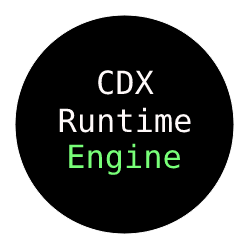

<p align="center">
  
</p>

# CDX Code Engine V4 is the Fourth Major Revision Of CDX Code Engine, An GDJSON Compiler.

### Currently Under Beta.

## Table Of Contents:
- How To Use
- Contributing
- To-Do List

## How To Use:

Example: Json Request
```python
import engine
jsonurl = 'engine.req("api.test.com/v1/json", "varname")'
engine.event("once", jsonurl)

engine.compile()
```
Add And Create Object Instance
```python
import engine
engine.addsprite("image.png", sprite1)
engine.newscene("scene")
engine.scene("scene", "engine.event("once",'engine.addobj("sprite1", "x", "y")')

engine.compile()
```
On Input Exit game
```python
import engine
engine.oninput("x", "engine.exit()")

engine.compile()
```

## Contributing: 
Contributing is highly recommended as it helps the development of the engine.
please make a pr request describing:
- The changes youve made
- Improvements
- Why you did it?

## To-Do List:
- Finish Functions [ ]
- Finish ReadMe [ ]
- Development [x]
- Planned Release [x]
